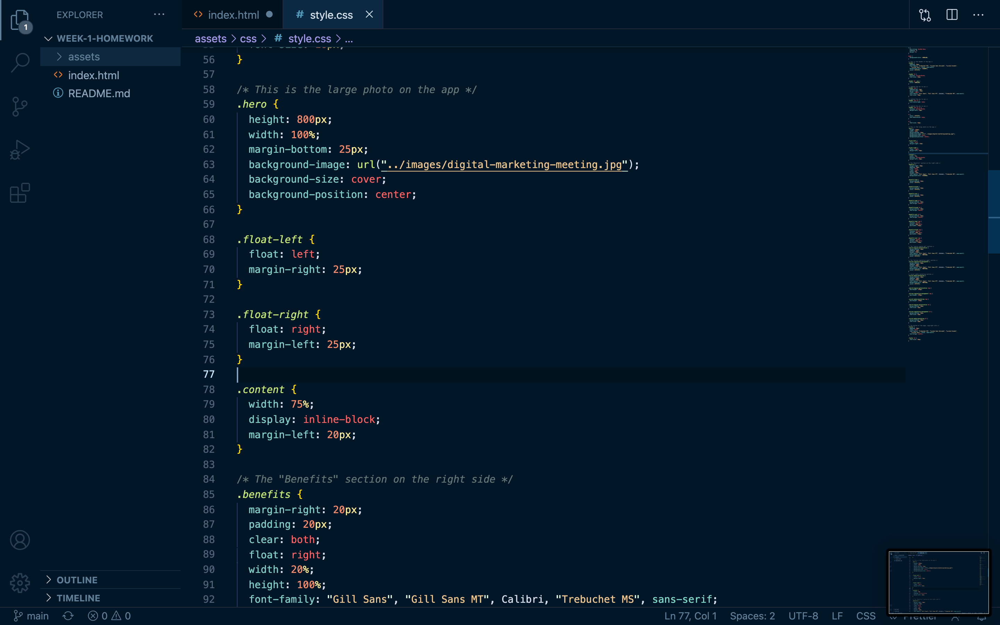
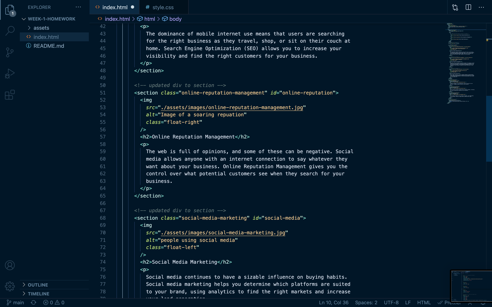

# <Refactoring for Horiseon>

## Description

Updated and improved the HTML and CSS on the Horiseon website to be more accessible.

- Changed div tags to semantic elements.
- Fixed broken links.
- Added descriptive CSS comments.

## Refactoring

- Added desciptive CSS.

- Made the HTML more accessible with semantic elements.

- Finished app with working links.
